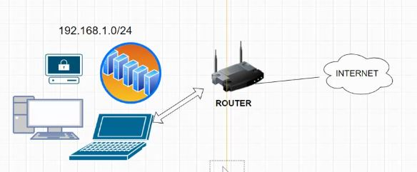
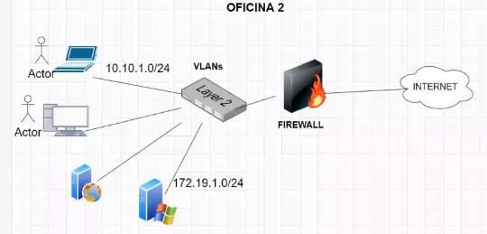
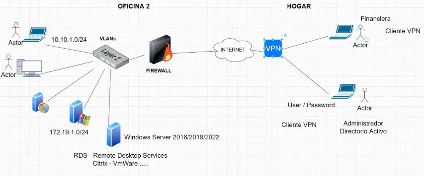
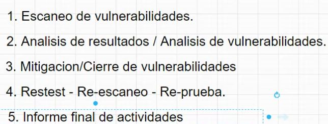

# Clase 01. Seguridad de la información

*Autor:* Daniel Arbeláez

*Creado:* 16/09/2022

*Docente:* Jhon Edison Rodriguez Guisado
***

## Tabla de contenido

- [Clase 01. Seguridad de la información](#clase-01-seguridad-de-la-información)
  - [Tabla de contenido](#tabla-de-contenido)
  - [Qué es un SGSI](#qué-es-un-sgsi)
  - [Escenarios en el proceso de transformación digital](#escenarios-en-el-proceso-de-transformación-digital)
  - [Vulnerabilidad en ciberseguridad](#vulnerabilidad-en-ciberseguridad)

## Qué es un SGSI

Conjunto de politicas de administración de la información (Gobierno de datos). Determina quiénes son los responsables y roles al uinterior de la empresa. Los pilares de SGSI son el tema documental y el tema de procedimiento, responde a las preguntas de lo que debemos y no debemos. Por otro lado, otro pilar es el de creación de soluciones para mantener una empresa segura.

Las ISO 27001, este estandar nos da el norte del cual muchas empresas han recorrido ese camino, esta norma se ha actualizado de acuerdo a las tecnologías.

> Se tiene que ver la seguridad de la información como un todo, desde las personas hasta los procedimientos de la empresa. Debe fijarse hasta en el más mínimo detalle.

Hacker (Concepto): Experto en seguridad informática. [bug-bounty](https://www.bugcrowd.com/bug-bounty-list/)

Dentro de las funciones del SGSI:

- Plan: Se define qué hace parte en el modelo de seguridad (Centros de datos, sedes, servidores, entorno híbrido (Azure, AWS más utilizadas)). Se debe tener claro la continuidad del negocio lo que permite dar recomendaciones al sistema de seguridad
- Do: Implementación de la solución
- Check: Revisar y evaluar el desempeño
- Act: Se realizan cambios cuando son necesarios

> Son los directivos los que indican hacia donde va la organización, se convierten en una espiral

## Escenarios en el proceso de transformación digital

Escenario antes de la transformación digital desde la oficina:

Escenario antes de la transformación digital mejorado desde la oficina

Escenario después de la transformación digital desde el hogar

> Es posible que en el tiempo estos escenario puedan cambiar para garantizar mejoras en seguridad

Blue team: defensa, seguimiento (logs), correlacion de eventos y se representan con un escudo (Dedica a defensa)
Red Team: Prueba las configuraciones o defensas del equipo azul (Dedica al ataque)
Purple Team: En él hacen parte personas de ambos equipos blue y red

> Los antivirus siempre ha  funciuonado en base a firmas, es decir, si un archivo con el hash (huella digital) identificado como malicioso se reporta como virus.
> Actualmente se manejan los EDR (Endpoint Detection Response) que permite evitar las fallas de los antivirus ya que los hackers pasaban la brecha del hash generando así una vulnerabilidad.

## Vulnerabilidad en ciberseguridad

Fallo informático que pone en peligro al sistema. Es decir, se trata de un bug que puede usar un  atacante con fines maliciosos. Para este tipo de vulnerabilidades normlamente la empresa lleva a cabo un ciclo para hacer verificaciones así:

Para el proceso 1 existen herramientas que automatizan ese ciclo, pueden ser software o hardware, una de ellas es Qualys que es la más conocida. Cada resultado arroja un código (CVE-2022-22123) y una severidad (Informativo - Baja - Media - Alta - Crítica). Lo más común es que se proceda a solucionar las vulnerabilidades que van desde media a crítica y a las mismas se les da una solución en un tiempo determinado que lo mínimo para media son 15 días y máximo 1 mes, para las altas mínimo 30 días a 2 meses, y las críticas van de 45 días a 3 meses.

Hay una empresa que se encarga de registrar las vulnerabilidades [CVE Mitre](https://cve.mitre.org/) y detalla la información que corresponde a su descripción, lo que puede afectar, referencias, fechas.

A veces cuando solo se tiene el código de la vulnerabilidad se puede buscar directamente en google, pero *no todo lo que nos arroje la busqueda será confiable*. Para refinar la busqueda se puede ingresar el código de la vulnerabilidad y la palabra Nessus, Rapid7, Qualys, OpenVAS.
