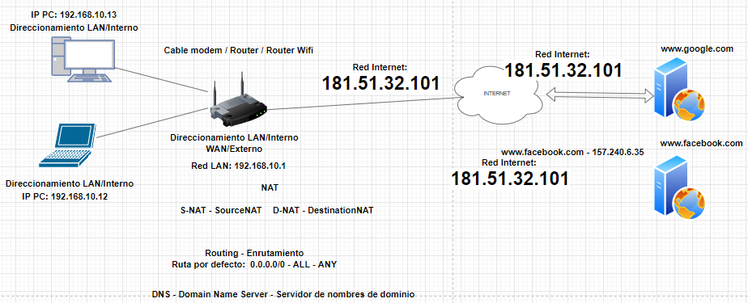
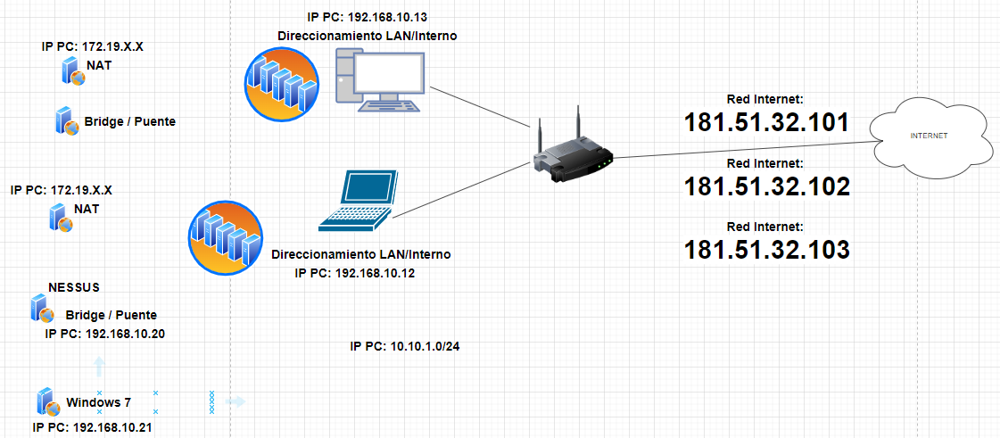

# Clase 03. Actualización del UbuntuServer

*Autor:* Daniel Arbeláez

*Creado:* 23/09/2022

*Docente:* Jhon Edison Rodriguez Guisado
***

## Tabla de contenido

- [Clase 03. Actualización del UbuntuServer](#clase-03-actualización-del-ubuntuserver)
  - [Tabla de contenido](#tabla-de-contenido)
  - [Preparación del ambiente del analizador de vulnerabilidades con UbuntuServer](#preparación-del-ambiente-del-analizador-de-vulnerabilidades-con-ubuntuserver)

Link para identificar ip del computador [cual es mi ip](https://www.cualesmiip.com/), [what is my ip](https://www.whatismyip.com/)

comandos del cmd, `ipconfig`, `ipconfig /all`

calculadora de ip [link](https://aprendaredes.com/cgi-bin/ipcalc/ipcalc_cgi1)

Si la red se configura en modo Bridge/Puente, el router identifica la VM como un computador adicional

En modo NAT, no podría hacerse esa conexión directamente como el Bridge

Lo recomendable es usar las VM como *Bridge*.

Configuracion de red con VM

## Preparación del ambiente del analizador de vulnerabilidades con UbuntuServer

1. Acceder como super user `sudo su`
2. Verificar conexión a la dirección ip `ping 8.8.8.8` (Ctrl + C para salir del envío de paquetes ping)
3. Instalar herramientas de red `apt install net-tools`
4. Solicitamos información de direccionamiento de red con `ifconfig`
5. Para preparar el SO buscando actualizaciones, buscarlas `apt update`; se puede verificar el listado de las actualizaciones con `apt list --upgradable`; luego se instalan con `apt upgrade`
6. Confirmamos la actualización OK
7. Luego hacemos una limpieza con `apt remove`
8. Reiniciamos el SO con `reboot`

Luego se usará el Ubuntu Server con un procedimiento automatizado de analisis de vulnerabilidades y lo aplicaremos en el Windows 7.
